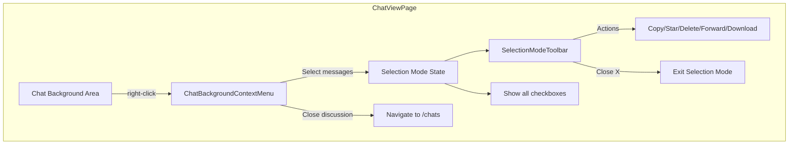
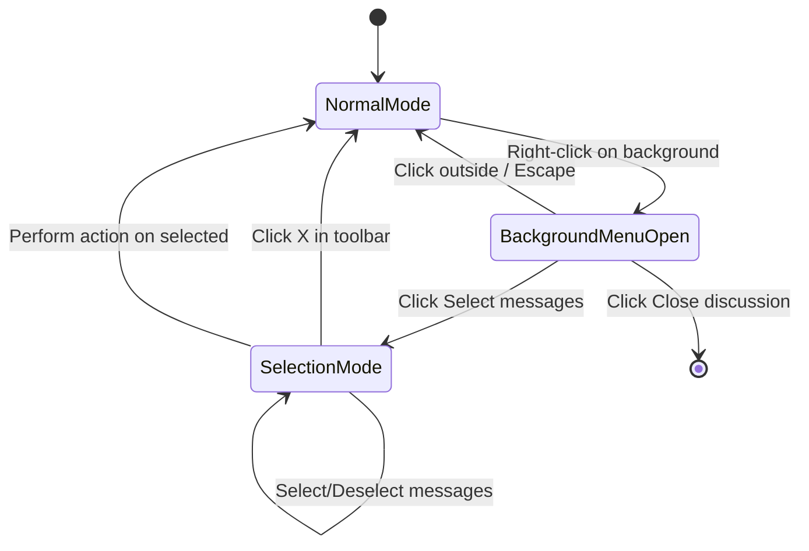

# Chat Background Right-Click Context Menu - Design Document

## Overview

This document outlines the design and implementation plan for a JemaOS-like right-click context menu feature on the chat background in the anu messaging app. This feature is specifically for the laptop/desktop version.

## Current Architecture Analysis

### Existing Components

#### 1. [`ChatViewPage.tsx`](../src/pages/ChatViewPage.tsx)
- **Location**: `anu/src/pages/ChatViewPage.tsx`
- **Purpose**: Main chat view component
- **Key State Variables**:
  - `selectedMessages: Set<string>` - Already exists for tracking selected messages
  - `contextMenu: { isOpen, position, message }` - Existing context menu state for individual messages
  - `hoveredMessageId: string | null` - Tracks which message is being hovered
- **Key Functions**:
  - [`handleContextMenu()`](../src/pages/ChatViewPage.tsx:319) - Handles right-click on messages
  - [`handleSelectMessage()`](../src/pages/ChatViewPage.tsx:332) - Toggles message selection
  - [`closeContextMenu()`](../src/pages/ChatViewPage.tsx:328) - Closes the context menu

#### 2. [`MessageContextMenu.tsx`](../src/components/MessageContextMenu.tsx)
- **Location**: `anu/src/components/MessageContextMenu.tsx`
- **Purpose**: Context menu for individual messages
- **Features**:
  - Emoji reaction bar
  - Menu items: Reply, Copy, Forward, Pin, Star, Select, Delete, etc.
  - Position adjustment to stay within viewport
  - Click outside and Escape key handling

#### 3. [`ConversationContextMenu.tsx`](../src/components/ConversationContextMenu.tsx)
- **Location**: `anu/src/components/ConversationContextMenu.tsx`
- **Purpose**: Context menu for conversation list items
- **Features**: Mark as unread, Pin, Archive, Mute, Delete, Close

#### 4. [`MessageHoverActions.tsx`](../src/components/MessageHoverActions.tsx)
- **Location**: `anu/src/components/MessageHoverActions.tsx`
- **Purpose**: Shows checkbox on message hover for selection
- **Already integrated** into ChatViewPage

#### 5. [`use-mobile.tsx`](../src/hooks/use-mobile.tsx)
- **Location**: `anu/src/hooks/use-mobile.tsx`
- **Purpose**: Detects if device is mobile (< 768px)
- **Usage**: `const isMobile = useIsMobile()`

### Current Message Selection Flow
1. User hovers over a message → `MessageHoverActions` shows checkbox
2. User clicks checkbox → `handleSelectMessage()` toggles selection
3. Selected messages are tracked in `selectedMessages` Set
4. Selected messages have visual highlight (`bg-[#00a884]/10`)

---

## Proposed Feature Design

### Feature Requirements

Based on the JemaOS reference screenshots:

1. **Right-click on chat background** (not on messages) → Show context menu with:
   - "Sélectionner des messages" (Select messages)
   - "Fermer la discussion" (Close discussion)

2. **Selection Mode** → When "Select messages" is clicked:
   - Show checkboxes next to ALL messages
   - Display bottom toolbar with:
     - Counter: "X sélectionné(s)"
     - Action icons: Copy, Star/Favorite, Delete, Forward, Download
     - X button to exit selection mode

---

## Component Architecture

### New Components to Create

```
anu/src/components/
├── ChatBackgroundContextMenu.tsx    # New - Background right-click menu
├── SelectionModeToolbar.tsx         # New - Bottom toolbar for selection mode
└── ... (existing components)
```

### Component Diagram



---

## Detailed Component Specifications

### 1. ChatBackgroundContextMenu Component

**File**: `anu/src/components/ChatBackgroundContextMenu.tsx`

```typescript
interface ChatBackgroundContextMenuProps {
  isOpen: boolean;
  position: { x: number; y: number };
  onClose: () => void;
  onSelectMessages: () => void;
  onCloseDiscussion: () => void;
}
```

**Features**:
- Simple dropdown menu with 2 options
- Position adjustment to stay within viewport
- Click outside to close
- Escape key to close
- JemaOS-style dark theme styling

**Menu Items**:
| Icon | Label | Action |
|------|-------|--------|
| CheckSquare | Sélectionner des messages | Enter selection mode |
| X | Fermer la discussion | Navigate back to /chats |

### 2. SelectionModeToolbar Component

**File**: `anu/src/components/SelectionModeToolbar.tsx`

```typescript
interface SelectionModeToolbarProps {
  selectedCount: number;
  onCopy: () => void;
  onStar: () => void;
  onDelete: () => void;
  onForward: () => void;
  onDownload: () => void;
  onClose: () => void;
}
```

**Features**:
- Fixed position at bottom of chat area
- Shows selected message count
- Action buttons with icons
- X button to exit selection mode
- Disabled state for actions when no messages selected

**Layout**:
```
┌─────────────────────────────────────────────────────────────┐
│  X  │  0 sélectionné  │  [Copy] [Star] [Delete] [Forward] [Download]  │
└─────────────────────────────────────────────────────────────┘
```

---

## State Management Design

### New State Variables in ChatViewPage

```typescript
// Existing
const [selectedMessages, setSelectedMessages] = useState<Set<string>>(new Set())

// New
const [isSelectionMode, setIsSelectionMode] = useState(false)
const [backgroundContextMenu, setBackgroundContextMenu] = useState<{
  isOpen: boolean;
  position: { x: number; y: number };
}>({ isOpen: false, position: { x: 0, y: 0 } })
```

### State Flow Diagram



---

## Implementation Plan

### Phase 1: Create ChatBackgroundContextMenu Component

**File**: `anu/src/components/ChatBackgroundContextMenu.tsx`

```typescript
import React, { useEffect, useRef } from 'react';
import { CheckSquare, X } from 'lucide-react';

interface ChatBackgroundContextMenuProps {
  isOpen: boolean;
  position: { x: number; y: number };
  onClose: () => void;
  onSelectMessages: () => void;
  onCloseDiscussion: () => void;
}

export const ChatBackgroundContextMenu: React.FC<ChatBackgroundContextMenuProps> = ({
  isOpen,
  position,
  onClose,
  onSelectMessages,
  onCloseDiscussion,
}) => {
  const menuRef = useRef<HTMLDivElement>(null);
  const [adjustedPosition, setAdjustedPosition] = useState(position);

  // Position adjustment logic
  useEffect(() => {
    if (isOpen && menuRef.current) {
      const menu = menuRef.current;
      const rect = menu.getBoundingClientRect();
      const viewportWidth = window.innerWidth;
      const viewportHeight = window.innerHeight;

      let newX = position.x;
      let newY = position.y;

      if (position.x + rect.width > viewportWidth - 10) {
        newX = viewportWidth - rect.width - 10;
      }
      if (position.y + rect.height > viewportHeight - 10) {
        newY = viewportHeight - rect.height - 10;
      }

      setAdjustedPosition({ x: Math.max(10, newX), y: Math.max(10, newY) });
    }
  }, [isOpen, position]);

  // Close handlers
  useEffect(() => {
    const handleClickOutside = (event: MouseEvent) => {
      if (menuRef.current && !menuRef.current.contains(event.target as Node)) {
        onClose();
      }
    };

    const handleEscape = (event: KeyboardEvent) => {
      if (event.key === 'Escape') {
        onClose();
      }
    };

    if (isOpen) {
      document.addEventListener('mousedown', handleClickOutside);
      document.addEventListener('keydown', handleEscape);
    }

    return () => {
      document.removeEventListener('mousedown', handleClickOutside);
      document.removeEventListener('keydown', handleEscape);
    };
  }, [isOpen, onClose]);

  if (!isOpen) return null;

  const menuItems = [
    {
      icon: CheckSquare,
      label: 'Sélectionner des messages',
      onClick: () => { onSelectMessages(); onClose(); },
    },
    {
      icon: X,
      label: 'Fermer la discussion',
      onClick: () => { onCloseDiscussion(); onClose(); },
    },
  ];

  return (
    <>
      <div className="fixed inset-0 z-50" onClick={onClose} />
      <div
        ref={menuRef}
        className="fixed z-50 min-w-[220px] bg-[#233138] rounded-lg shadow-2xl border border-[#3b4a54] py-2"
        style={{
          left: adjustedPosition.x,
          top: adjustedPosition.y,
        }}
      >
        {menuItems.map((item, index) => {
          const Icon = item.icon;
          return (
            <button
              key={index}
              onClick={item.onClick}
              className="w-full flex items-center gap-3 px-4 py-3 hover:bg-[#3b4a54] transition-colors text-left text-[#e9edef]"
              type="button"
            >
              <Icon size={18} className="text-[#8696a0]" />
              <span className="text-sm">{item.label}</span>
            </button>
          );
        })}
      </div>
    </>
  );
};
```

### Phase 2: Create SelectionModeToolbar Component

**File**: `anu/src/components/SelectionModeToolbar.tsx`

```typescript
import React from 'react';
import { X, Copy, Star, Trash2, Forward, Download } from 'lucide-react';

interface SelectionModeToolbarProps {
  selectedCount: number;
  onCopy: () => void;
  onStar: () => void;
  onDelete: () => void;
  onForward: () => void;
  onDownload: () => void;
  onClose: () => void;
}

export const SelectionModeToolbar: React.FC<SelectionModeToolbarProps> = ({
  selectedCount,
  onCopy,
  onStar,
  onDelete,
  onForward,
  onDownload,
  onClose,
}) => {
  const hasSelection = selectedCount > 0;

  const actions = [
    { icon: Copy, label: 'Copier', onClick: onCopy },
    { icon: Star, label: 'Favoris', onClick: onStar },
    { icon: Trash2, label: 'Supprimer', onClick: onDelete, danger: true },
    { icon: Forward, label: 'Transférer', onClick: onForward },
    { icon: Download, label: 'Télécharger', onClick: onDownload },
  ];

  return (
    <div className="fixed bottom-0 left-0 right-0 md:relative bg-[#233138] border-t border-[#3b4a54] px-4 py-3 flex items-center justify-between z-50">
      <div className="flex items-center gap-4">
        <button
          onClick={onClose}
          className="w-10 h-10 rounded-full hover:bg-[#3b4a54] flex items-center justify-center transition-colors"
          type="button"
          aria-label="Fermer le mode sélection"
        >
          <X size={20} className="text-[#8696a0]" />
        </button>
        <span className="text-sm text-[#e9edef]">
          {selectedCount} sélectionné{selectedCount > 1 ? 's' : ''}
        </span>
      </div>

      <div className="flex items-center gap-2">
        {actions.map((action, index) => {
          const Icon = action.icon;
          return (
            <button
              key={index}
              onClick={action.onClick}
              disabled={!hasSelection}
              className={`w-10 h-10 rounded-full flex items-center justify-center transition-colors ${
                hasSelection
                  ? action.danger
                    ? 'hover:bg-red-500/20 text-red-500'
                    : 'hover:bg-[#3b4a54] text-[#8696a0]'
                  : 'opacity-50 cursor-not-allowed text-[#8696a0]'
              }`}
              type="button"
              aria-label={action.label}
              title={action.label}
            >
              <Icon size={20} />
            </button>
          );
        })}
      </div>
    </div>
  );
};
```

### Phase 3: Modify ChatViewPage.tsx

**Changes Required**:

1. **Add new imports**:
```typescript
import { ChatBackgroundContextMenu } from '@/components/ChatBackgroundContextMenu'
import { SelectionModeToolbar } from '@/components/SelectionModeToolbar'
import { useIsMobile } from '@/hooks/use-mobile'
```

2. **Add new state variables**:
```typescript
const [isSelectionMode, setIsSelectionMode] = useState(false)
const [backgroundContextMenu, setBackgroundContextMenu] = useState<{
  isOpen: boolean;
  position: { x: number; y: number };
}>({ isOpen: false, position: { x: 0, y: 0 } })

const isMobile = useIsMobile()
```

3. **Add background right-click handler**:
```typescript
const handleBackgroundContextMenu = useCallback((e: React.MouseEvent) => {
  // Only on desktop
  if (isMobile) return;
  
  // Check if click is on the background, not on a message
  const target = e.target as HTMLElement;
  const isOnMessage = target.closest('[data-message-id]');
  
  if (!isOnMessage) {
    e.preventDefault();
    setBackgroundContextMenu({
      isOpen: true,
      position: { x: e.clientX, y: e.clientY },
    });
  }
}, [isMobile]);

const closeBackgroundContextMenu = useCallback(() => {
  setBackgroundContextMenu({ isOpen: false, position: { x: 0, y: 0 } });
}, []);

const enterSelectionMode = useCallback(() => {
  setIsSelectionMode(true);
  setSelectedMessages(new Set());
}, []);

const exitSelectionMode = useCallback(() => {
  setIsSelectionMode(false);
  setSelectedMessages(new Set());
}, []);
```

4. **Add selection mode action handlers**:
```typescript
const handleBulkCopy = useCallback(async () => {
  const selectedMsgs = messages.filter(m => selectedMessages.has(m.id));
  const textContent = selectedMsgs
    .filter(m => m.type === 'text' && m.content)
    .map(m => m.content)
    .join('\n');
  
  if (textContent) {
    await navigator.clipboard.writeText(textContent);
    alert('Messages copiés!');
  }
  exitSelectionMode();
}, [messages, selectedMessages, exitSelectionMode]);

const handleBulkStar = useCallback(async () => {
  // TODO: Implement bulk star
  alert(`${selectedMessages.size} message(s) marqué(s) comme important(s)`);
  exitSelectionMode();
}, [selectedMessages, exitSelectionMode]);

const handleBulkDelete = useCallback(async () => {
  if (confirm(`Supprimer ${selectedMessages.size} message(s)?`)) {
    const ids = Array.from(selectedMessages);
    await supabase
      .from('messages')
      .update({ deleted_at: new Date().toISOString() })
      .in('id', ids);
    
    setMessages(prev => prev.filter(m => !selectedMessages.has(m.id)));
    exitSelectionMode();
  }
}, [selectedMessages, exitSelectionMode]);

const handleBulkForward = useCallback(() => {
  // TODO: Implement bulk forward
  alert(`Transférer ${selectedMessages.size} message(s)`);
  exitSelectionMode();
}, [selectedMessages, exitSelectionMode]);

const handleBulkDownload = useCallback(async () => {
  const selectedMsgs = messages.filter(m => selectedMessages.has(m.id));
  const mediaMessages = selectedMsgs.filter(m => m.media_url);
  
  if (mediaMessages.length === 0) {
    alert('Aucun média à télécharger');
    return;
  }
  
  // Download each media file
  for (const msg of mediaMessages) {
    if (msg.media_url) {
      try {
        const response = await fetch(msg.media_url);
        const blob = await response.blob();
        const url = window.URL.createObjectURL(blob);
        const a = document.createElement('a');
        a.href = url;
        a.download = msg.file_name || `download-${Date.now()}`;
        document.body.appendChild(a);
        a.click();
        document.body.removeChild(a);
        window.URL.revokeObjectURL(url);
      } catch (error) {
        console.error('Error downloading:', error);
      }
    }
  }
  
  exitSelectionMode();
}, [messages, selectedMessages, exitSelectionMode]);
```

5. **Modify the messages container div** (around line 501):
```tsx
<div 
  className="flex-1 overflow-y-auto p-2 sm:p-3 md:p-4 space-y-2 pb-24 md:pb-4" 
  style={getWallpaperStyle()}
  onContextMenu={handleBackgroundContextMenu}
>
```

6. **Add data attribute to message containers** for detection:
```tsx
<div
  key={message.id}
  data-message-id={message.id}  // Add this attribute
  className={`flex ${isOwn ? 'justify-end' : 'justify-start'} mb-1 ${isSelected ? 'bg-[#00a884]/10' : ''}`}
  // ... rest of props
>
```

7. **Modify MessageHoverActions visibility** to show in selection mode:
```tsx
<MessageHoverActions
  isVisible={hoveredMessageId === message.id || isSelectionMode}
  isSelected={isSelected}
  isOwn={isOwn}
  onSelect={() => handleSelectMessage(message.id)}
/>
```

8. **Add the new components to the render**:
```tsx
{/* Background Context Menu - Desktop only */}
{!isMobile && (
  <ChatBackgroundContextMenu
    isOpen={backgroundContextMenu.isOpen}
    position={backgroundContextMenu.position}
    onClose={closeBackgroundContextMenu}
    onSelectMessages={enterSelectionMode}
    onCloseDiscussion={() => navigate('/chats')}
  />
)}

{/* Selection Mode Toolbar */}
{isSelectionMode && (
  <SelectionModeToolbar
    selectedCount={selectedMessages.size}
    onCopy={handleBulkCopy}
    onStar={handleBulkStar}
    onDelete={handleBulkDelete}
    onForward={handleBulkForward}
    onDownload={handleBulkDownload}
    onClose={exitSelectionMode}
  />
)}
```

9. **Hide input bar when in selection mode**:
```tsx
{/* Input Bar - Hide in selection mode */}
{!isSelectionMode && (
  <div className="fixed md:relative bottom-14 md:bottom-0 ...">
    {/* ... input bar content */}
  </div>
)}
```

---

## CSS/Styling Considerations

### Theme Consistency
All new components use the existing JemaOS-style dark theme:
- Background: `#233138` (bg-surface)
- Hover: `#3b4a54` (bg-hover)
- Border: `#3b4a54`
- Text primary: `#e9edef`
- Text secondary: `#8696a0`
- Accent: `#00a884`
- Danger: `#ea4335` / `red-500`

### Responsive Design
- Background context menu: **Desktop only** (hidden on mobile via `useIsMobile()`)
- Selection toolbar: Fixed at bottom on mobile, relative on desktop
- Checkboxes: Always visible in selection mode, hover-only in normal mode

### Z-Index Hierarchy
```
z-40: Backdrop overlays
z-50: Context menus, toolbars
```

---

## Files to Create/Modify Summary

### New Files
| File | Purpose |
|------|---------|
| `anu/src/components/ChatBackgroundContextMenu.tsx` | Background right-click menu |
| `anu/src/components/SelectionModeToolbar.tsx` | Bottom toolbar for selection mode |

### Modified Files
| File | Changes |
|------|---------|
| `anu/src/pages/ChatViewPage.tsx` | Add selection mode state, handlers, integrate new components |

---

## Testing Checklist

- [ ] Right-click on chat background shows context menu (desktop only)
- [ ] Right-click on message still shows message context menu
- [ ] "Sélectionner des messages" enters selection mode
- [ ] "Fermer la discussion" navigates to /chats
- [ ] Selection mode shows checkboxes on all messages
- [ ] Selection toolbar shows correct count
- [ ] Copy action copies text content of selected messages
- [ ] Delete action deletes selected messages
- [ ] Forward action triggers forward flow
- [ ] Download action downloads media from selected messages
- [ ] X button exits selection mode and clears selection
- [ ] Context menu does not appear on mobile devices
- [ ] Escape key closes context menu
- [ ] Click outside closes context menu

---

## Future Enhancements

1. **Keyboard shortcuts**: Ctrl+A to select all messages
2. **Drag selection**: Click and drag to select multiple messages
3. **Select all button**: In the toolbar
4. **Message range selection**: Shift+click to select range
5. **Persist selection**: Remember selection when scrolling