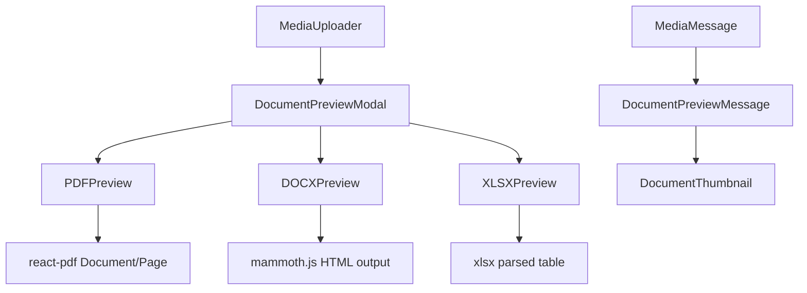
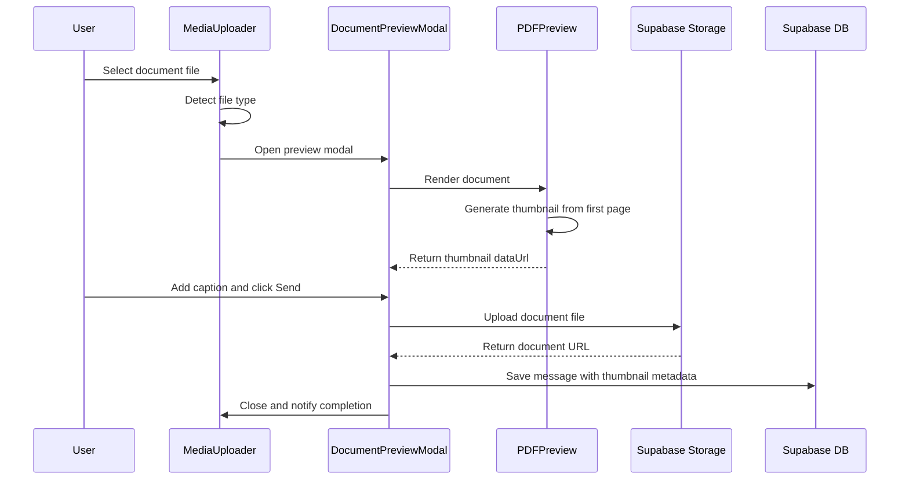
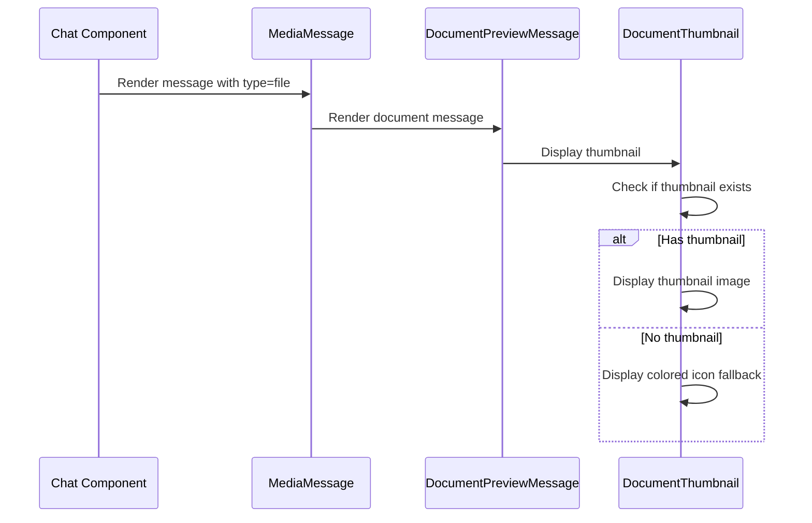
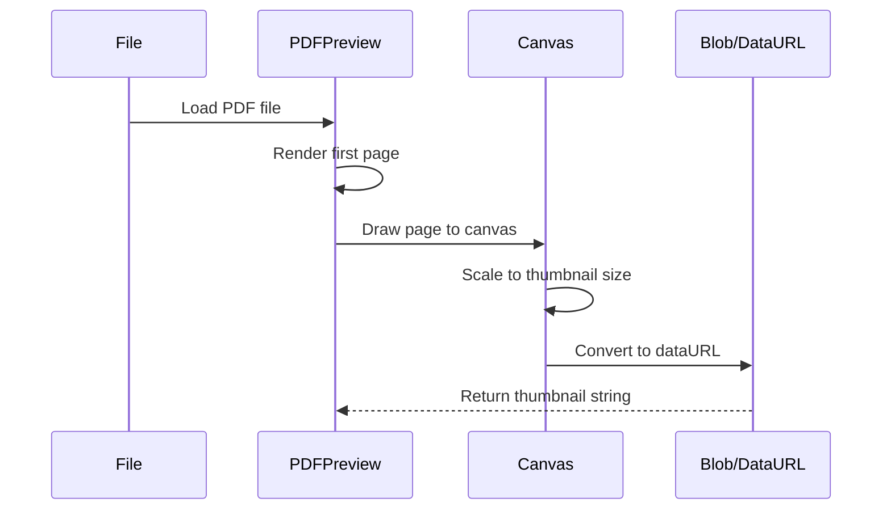

# Document Preview System Architecture

## Overview

This document outlines the architecture for implementing a WhatsApp-like document preview system in the Anu messaging application. The system will provide real document content previews both before sending (full preview screen) and in chat messages (thumbnail preview).

## Table of Contents

1. [Requirements Analysis](#requirements-analysis)
2. [Library Recommendations](#library-recommendations)
3. [Component Architecture](#component-architecture)
4. [Data Flow](#data-flow)
5. [Implementation Plan](#implementation-plan)
6. [Performance Optimizations](#performance-optimizations)
7. [File Modifications](#file-modifications)

---

## Requirements Analysis

### Current State

The existing [`MediaUploader.tsx`](../src/components/MediaUploader.tsx) component handles:
- Image uploads with preview and editing capabilities
- Video uploads with preview
- Document uploads (PDF, DOCX, XLSX, etc.) with **icon-only display** (no content preview)

The [`MediaMessage.tsx`](../src/components/MediaMessage.tsx) component displays:
- Images with blur placeholder and progressive loading
- Videos with thumbnail and play button
- Documents with **colored icon based on file type** (no content preview)

### Target State (WhatsApp-like)

1. **Before Sending (Preview Screen)**:
   - Full rendered PDF content with page navigation
   - Scrollable document view
   - Caption input field
   - Send button

2. **In Chat (Message Display)**:
   - Thumbnail preview of first page content
   - Document metadata (name, size, type)
   - Download button

---

## Library Recommendations

### PDF Preview Libraries

| Library | Bundle Size | Pros | Cons | Recommendation |
|---------|-------------|------|------|----------------|
| **react-pdf** | ~500KB (with worker) | Easy React integration, good docs, active maintenance | Requires PDF.js worker setup | ✅ **Recommended** |
| **@react-pdf-viewer/core** | ~800KB | Feature-rich, plugins system, zoom/search | Larger bundle, more complex | Good for advanced needs |
| **pdfjs-dist** (raw) | ~400KB | Most flexible, smallest core | More setup required | For custom implementations |

**Recommendation**: Use `react-pdf` for the best balance of ease-of-use and bundle size.

```bash
npm install react-pdf
```

### Office Document Libraries

| Library | Purpose | Pros | Cons | Recommendation |
|---------|---------|------|------|----------------|
| **mammoth.js** | DOCX → HTML | Lightweight (~50KB), good text extraction | Limited styling support | ✅ For DOCX preview |
| **xlsx** | Excel parsing | Full Excel support, formulas | Large bundle (~300KB) | ✅ For XLSX preview |
| **docx-preview** | DOCX rendering | Better styling than mammoth | Larger, less maintained | Alternative |
| **pptx2html** | PPTX rendering | PowerPoint support | Limited, not well maintained | ⚠️ Consider server-side |

**Recommendation**: 
- PDF: `react-pdf`
- DOCX: `mammoth.js` for text extraction + custom HTML rendering
- XLSX: `xlsx` for data extraction + custom table rendering
- PPTX: Server-side conversion or thumbnail generation (complex client-side)

```bash
npm install react-pdf mammoth xlsx
```

### Thumbnail Generation Strategy

For chat message thumbnails, we have two approaches:

1. **Client-side Generation** (Recommended for PDFs):
   - Render first page to canvas
   - Convert to data URL
   - Store as thumbnail in message metadata

2. **Server-side Generation** (Recommended for Office docs):
   - Use Supabase Edge Functions or external service
   - Generate thumbnail on upload
   - Store thumbnail URL with document

---

## Component Architecture

### New Components

```
src/components/
├── DocumentPreview/
│   ├── index.ts                    # Barrel export
│   ├── DocumentPreviewModal.tsx    # Full-screen preview before sending
│   ├── PDFPreview.tsx              # PDF rendering component
│   ├── DOCXPreview.tsx             # Word document preview
│   ├── XLSXPreview.tsx             # Excel preview
│   ├── DocumentThumbnail.tsx       # Thumbnail generator/display
│   └── DocumentPreviewMessage.tsx  # Chat message with preview
```

### Component Hierarchy



### Component Specifications

#### 1. DocumentPreviewModal

**Purpose**: Full-screen preview before sending (like WhatsApp)

**Props**:
```typescript
interface DocumentPreviewModalProps {
  file: File;
  isOpen: boolean;
  onClose: () => void;
  onSend: (file: File, caption: string, thumbnail?: string) => void;
}
```

**Features**:
- Full-screen overlay with dark background
- Document content rendering based on type
- Page navigation for multi-page documents
- Caption input field
- Send/Cancel buttons
- Thumbnail generation on send

#### 2. PDFPreview

**Purpose**: Render PDF pages using react-pdf

**Props**:
```typescript
interface PDFPreviewProps {
  file: File | string; // File object or URL
  onThumbnailGenerated?: (dataUrl: string) => void;
  maxPages?: number;
  showControls?: boolean;
}
```

**Features**:
- Page-by-page rendering
- Zoom controls
- Page navigation
- First page thumbnail generation

#### 3. DOCXPreview

**Purpose**: Render Word documents using mammoth.js

**Props**:
```typescript
interface DOCXPreviewProps {
  file: File;
  onThumbnailGenerated?: (dataUrl: string) => void;
}
```

**Features**:
- Convert DOCX to HTML
- Styled container for display
- Screenshot-based thumbnail generation

#### 4. XLSXPreview

**Purpose**: Render Excel spreadsheets

**Props**:
```typescript
interface XLSXPreviewProps {
  file: File;
  onThumbnailGenerated?: (dataUrl: string) => void;
  maxRows?: number;
  maxCols?: number;
}
```

**Features**:
- Parse and display spreadsheet data
- Sheet tabs for multi-sheet files
- Table-based rendering

#### 5. DocumentThumbnail

**Purpose**: Display document thumbnail in chat

**Props**:
```typescript
interface DocumentThumbnailProps {
  thumbnailUrl?: string;
  documentType: 'pdf' | 'docx' | 'xlsx' | 'pptx' | 'other';
  fileName: string;
  isLoading?: boolean;
}
```

**Features**:
- Display thumbnail image if available
- Fallback to colored icon if no thumbnail
- Loading state

#### 6. DocumentPreviewMessage

**Purpose**: Enhanced document message with thumbnail

**Props**:
```typescript
interface DocumentPreviewMessageProps {
  url: string;
  fileName: string;
  fileSize: number;
  thumbnail?: string;
  documentType: string;
  caption?: string;
  timestamp: string;
  isOwn: boolean;
  status?: 'sent' | 'delivered' | 'read';
  onDownload: () => void;
}
```

---

## Data Flow

### Upload Flow with Preview



### Message Display Flow



### Thumbnail Generation Flow



---

## Implementation Plan

### Phase 1: PDF Preview (Priority: High)

**Duration**: 2-3 days

1. **Install dependencies**:
   ```bash
   npm install react-pdf
   ```

2. **Create PDFPreview component**:
   - Set up PDF.js worker
   - Implement page rendering
   - Add navigation controls
   - Implement thumbnail generation

3. **Create DocumentPreviewModal**:
   - Full-screen overlay UI
   - Caption input
   - Send/Cancel actions
   - Integration with PDFPreview

4. **Modify MediaUploader.tsx**:
   - Detect PDF files
   - Open DocumentPreviewModal instead of simple preview
   - Handle thumbnail in upload callback

5. **Modify MediaMessage.tsx**:
   - Display thumbnail for documents
   - Fallback to icon if no thumbnail

### Phase 2: Office Documents (Priority: Medium)

**Duration**: 3-4 days

1. **Install dependencies**:
   ```bash
   npm install mammoth xlsx
   ```

2. **Create DOCXPreview component**:
   - Parse DOCX with mammoth.js
   - Render HTML content
   - Generate thumbnail via html2canvas

3. **Create XLSXPreview component**:
   - Parse XLSX with xlsx library
   - Render as HTML table
   - Generate thumbnail

4. **Update DocumentPreviewModal**:
   - Route to correct preview component based on file type
   - Handle all document types

### Phase 3: Optimization (Priority: Medium)

**Duration**: 2 days

1. **Lazy loading**:
   - Dynamic imports for preview components
   - Load PDF.js worker on demand

2. **Caching**:
   - Cache generated thumbnails
   - Use IndexedDB for offline support

3. **Performance**:
   - Limit rendered pages
   - Optimize thumbnail size
   - Add loading states

### Phase 4: Server-side Fallback (Priority: Low)

**Duration**: 2-3 days

1. **Supabase Edge Function**:
   - Create thumbnail generation function
   - Support for complex documents (PPTX)

2. **Integration**:
   - Call edge function on upload
   - Store generated thumbnail URL

---

## Performance Optimizations

### 1. Lazy Loading

```typescript
// Lazy load PDF preview only when needed
const PDFPreview = React.lazy(() => import('./PDFPreview'));

// In component
<Suspense fallback={<LoadingSpinner />}>
  <PDFPreview file={file} />
</Suspense>
```

### 2. Web Worker for PDF.js

```typescript
// Configure PDF.js worker
import { pdfjs } from 'react-pdf';
pdfjs.GlobalWorkerOptions.workerSrc = `//unpkg.com/pdfjs-dist@${pdfjs.version}/build/pdf.worker.min.js`;
```

### 3. Thumbnail Caching

```typescript
// Cache thumbnails in IndexedDB
const thumbnailCache = new Map<string, string>();

async function getCachedThumbnail(fileHash: string): Promise<string | null> {
  // Check memory cache first
  if (thumbnailCache.has(fileHash)) {
    return thumbnailCache.get(fileHash)!;
  }
  
  // Check IndexedDB
  const cached = await db.thumbnails.get(fileHash);
  if (cached) {
    thumbnailCache.set(fileHash, cached.dataUrl);
    return cached.dataUrl;
  }
  
  return null;
}
```

### 4. Progressive Loading

```typescript
// Load thumbnail first, then full preview
const [thumbnailLoaded, setThumbnailLoaded] = useState(false);
const [fullPreviewLoaded, setFullPreviewLoaded] = useState(false);

// Show thumbnail immediately, load full preview in background
```

### 5. Memory Management

```typescript
// Clean up object URLs
useEffect(() => {
  const objectUrl = URL.createObjectURL(file);
  return () => URL.revokeObjectURL(objectUrl);
}, [file]);
```

---

## File Modifications

### Files to Create

| File | Purpose |
|------|---------|
| `src/components/DocumentPreview/index.ts` | Barrel exports |
| `src/components/DocumentPreview/DocumentPreviewModal.tsx` | Full preview modal |
| `src/components/DocumentPreview/PDFPreview.tsx` | PDF rendering |
| `src/components/DocumentPreview/DOCXPreview.tsx` | Word doc rendering |
| `src/components/DocumentPreview/XLSXPreview.tsx` | Excel rendering |
| `src/components/DocumentPreview/DocumentThumbnail.tsx` | Thumbnail display |
| `src/lib/documentUtils.ts` | Document utility functions |

### Files to Modify

| File | Changes |
|------|---------|
| `src/components/MediaUploader.tsx` | Add document preview modal integration |
| `src/components/MediaMessage.tsx` | Add thumbnail display for documents |
| `package.json` | Add new dependencies |

### Detailed Modification: MediaUploader.tsx

```typescript
// Add imports
import { DocumentPreviewModal } from './DocumentPreview';

// Add state
const [showDocumentPreview, setShowDocumentPreview] = useState(false);
const [documentToPreview, setDocumentToPreview] = useState<File | null>(null);

// Modify handleFileSelect for documents
const handleFileSelect = (e: React.ChangeEvent<HTMLInputElement>) => {
  const file = files[0];
  const type = getFileType(file);
  
  if (type === 'file' && isPreviewableDocument(file)) {
    setDocumentToPreview(file);
    setShowDocumentPreview(true);
    return;
  }
  
  // ... existing logic
};

// Add helper function
const isPreviewableDocument = (file: File): boolean => {
  const ext = file.name.split('.').pop()?.toLowerCase();
  return ['pdf', 'doc', 'docx', 'xls', 'xlsx'].includes(ext || '');
};

// Add document preview modal in render
{showDocumentPreview && documentToPreview && (
  <DocumentPreviewModal
    file={documentToPreview}
    isOpen={showDocumentPreview}
    onClose={() => {
      setShowDocumentPreview(false);
      setDocumentToPreview(null);
    }}
    onSend={handleDocumentSend}
  />
)}
```

### Detailed Modification: MediaMessage.tsx

```typescript
// Modify file type rendering section
if (type === 'file') {
  const extension = getFileExtension(fileName);
  const { bgColor, icon } = getFileIconConfig(extension);
  const hasThumbnail = !!thumbnail;
  
  return (
    <div className="relative">
      <div className={`relative rounded-xl overflow-hidden border-[3px] border-[#787add] max-w-[280px]`}>
        {/* Thumbnail preview if available */}
        {hasThumbnail && (
          <div className="w-full h-32 bg-white">
            
          </div>
        )}
        
        {/* Document info section */}
        <div className={`flex items-center gap-3 p-3 ${isOwn ? 'bg-[#787add]' : 'bg-bg-surface'}`}>
          {/* ... existing icon and info */}
        </div>
      </div>
    </div>
  );
}
```

---

## Message Metadata Schema

Update the message metadata to include document thumbnail:

```typescript
interface DocumentMetadata {
  // Existing fields
  fileName: string;
  fileSize: number;
  
  // New fields for preview
  thumbnail?: string;        // Base64 data URL of first page
  pageCount?: number;        // Total pages (for PDF)
  documentType: 'pdf' | 'docx' | 'xlsx' | 'pptx' | 'other';
}
```

---

## Security Considerations

1. **File Validation**: Validate file types on both client and server
2. **Size Limits**: Enforce maximum file sizes for preview generation
3. **Sanitization**: Sanitize HTML output from mammoth.js
4. **CORS**: Ensure proper CORS headers for PDF.js worker

---

## Testing Checklist

- [ ] PDF preview renders correctly
- [ ] PDF thumbnail generates properly
- [ ] DOCX preview shows content
- [ ] XLSX preview shows table data
- [ ] Thumbnails display in chat messages
- [ ] Fallback icons work when no thumbnail
- [ ] Large files don't crash the browser
- [ ] Memory is properly cleaned up
- [ ] Mobile responsiveness
- [ ] Offline thumbnail caching

---

## Conclusion

This architecture provides a comprehensive solution for implementing WhatsApp-like document previews in the Anu messaging app. The phased approach allows for incremental implementation, starting with PDF support (most common use case) and expanding to Office documents.

Key benefits:
- **User Experience**: Real document content preview before sending
- **Performance**: Lazy loading and caching for optimal performance
- **Maintainability**: Modular component structure
- **Extensibility**: Easy to add support for new document types

Estimated total implementation time: **9-12 days**