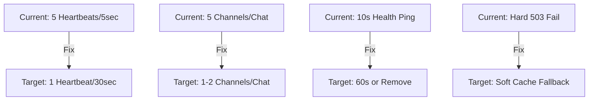

# Performance Optimization Plan - WhatsApp-Level Performance

## Executive Summary

The current application is experiencing performance issues due to excessive network requests. The 503 errors from Supabase are causing the app to retry requests repeatedly, creating a cascade of failed network calls. This document outlines the root causes and proposed solutions to achieve WhatsApp-level performance.

---

## Root Cause Analysis

### 🔴 Critical Issues (Immediate Action Required)

#### 1. **Aggressive Realtime Heartbeat** (supabase.ts:23)
```javascript
heartbeat_interval: 5  // 5 seconds - WAY TOO AGGRESSIVE
```
- **Problem**: Sends heartbeat every 5 seconds PER channel
- **Impact**: With 5 channels in ChatViewPage = 1 heartbeat/second to Supabase
- **Solution**: Increase to 30-60 seconds (WhatsApp uses ~30s)

#### 2. **Multiple Realtime Channels** (ChatViewPage.tsx:637-752)
- **Current**: 5 separate channels per conversation
  - call_logsChannel
  - messagesChannel
  - broadcastChannel
  - profilesChannel
  - memberLeftChannel
- **Solution**: Consolidate into 1-2 channels using event filtering

#### 3. **Excessive Health Check Pings** (supabase.ts:164)
```javascript
pingInterval = setInterval(pingConnection, 10000)  // Every 10 seconds
```
- **Problem**: Database query every 10 seconds
- **Solution**: Remove or increase to 60+ seconds

#### 4. **Service Worker Error Handling** (sw.js:231-234)
```javascript
return new Response(
  JSON.stringify({ error: 'Offline', message: 'No network connection' }),
  { status: 503, statusText: 'Service Unavailable' }
)
```
- **Problem**: Returns error response, triggering app retry logic
- **Solution**: Return cached data with warning header, don't fail hard

---

### 🟡 Major Issues (High Priority)

#### 5. **No Request Deduplication**
- Multiple components making same requests simultaneously
- Example: profiles requested by ChatViewPage, ChatsPage, ConversationInfo

#### 6. **Broadcast Channel Inefficiency** (supabase.ts:356-368)
- Creates new channel for each message sent
- Should reuse existing channel

#### 7. **Missing Optimistic Updates**
- UI waits for server response before updating
- Should update UI immediately, rollback on failure

---

### 🟠 Moderate Issues (Medium Priority)

#### 8. **No Request Batching**
- Each message status update = separate request
- Should batch updates

#### 9. **Missing Debouncing on User Input**
- Search, typing indicators triggering too many requests

#### 10. **No Lazy Loading of Historical Messages**
- Loading too much data initially

---

## Proposed Solutions

### Phase 1: Critical Fixes (Immediate)



#### 1.1 Fix Heartbeat Interval
```typescript
// supabase.ts - Change heartbeat_interval
realtime: {
  params: {
    heartbeat_interval: 30,  // 30 seconds (WhatsApp uses ~30s)
    timeout: 60000,
  },
}
```

#### 1.2 Consolidate Realtime Channels
```typescript
// Instead of 5 separate channels, use ONE channel with event filtering
const mainChannel = supabase
  .channel(`chat:${conversationId}`)
  .on('postgres_changes', { event: 'INSERT', schema: 'public', table: 'messages' }, handleNewMessage)
  .on('postgres_changes', { event: 'UPDATE', schema: 'public', table: 'messages' }, handleMessageUpdate)
  .on('postgres_changes', { event: 'INSERT', schema: 'public', table: 'call_logs' }, handleCallLog)
  .on('postgres_changes', { event: 'UPDATE', schema: 'public', table: 'profiles' }, handleProfileUpdate)
  .subscribe()
```

#### 1.3 Fix Service Worker Error Handling
```typescript
// sw.js - Return cached data instead of 503 error
async function networkFirstSupabase(request) {
  const cachedResponse = await caches.match(request);
  
  // ALWAYS return cache if available, don't fail
  if (cachedResponse) {
    // Try to update in background
    fetchWithTimeout(request, SUPABASE_TIMEOUT)
      .then(response => response.ok && caches.open(SUPABASE_CACHE).then(c => c.put(request, response.clone())))
      .catch(() => {})
    return cachedResponse;  // Return cache immediately
  }
  
  // Only if no cache, try network
  try {
    return await fetchWithTimeout(request, SUPABASE_TIMEOUT);
  } catch {
    // Return empty valid response instead of error
    return new Response(JSON.stringify({ data: [], error: null }), { 
      headers: { 'Content-Type': 'application/json' } 
    });
  }
}
```

---

### Phase 2: Major Improvements (High Priority)

#### 2.1 Implement Request Deduplication
```typescript
// Create a request cache/map to prevent duplicate queries
const pendingRequests = new Map<string, Promise<any>>();

async function deduplicatedQuery(key: string, queryFn: () => Promise<any>) {
  if (pendingRequests.has(key)) {
    return pendingRequests.get(key);
  }
  
  const promise = queryFn().finally(() => pendingRequests.delete(key));
  pendingRequests.set(key, promise);
  return promise;
}
```

#### 2.2 Fix Broadcast Channel
```typescript
// Maintain persistent broadcast channel per conversation
const broadcastChannels = new Map<string, RealtimeChannel>();

function getOrCreateBroadcastChannel(conversationId: string) {
  if (!broadcastChannels.has(conversationId)) {
    broadcastChannels.set(conversationId, supabase.channel(`broadcast:${conversationId}`));
  }
  return broadcastChannels.get(conversationId);
}
```

---

### Phase 3: Optimizations (Medium Priority)

#### 3.1 Add Optimistic Updates
```typescript
// Update UI immediately, rollback on error
const handleSendMessage = async (content: string) => {
  const tempId = generateTempId();
  
  // 1. Optimistically add to UI
  setMessages(prev => [...prev, { id: tempId, content, status: 'sent' }]);
  
  // 2. Send to server
  const { error } = await supabase.from('messages').insert({ content });
  
  // 3. Rollback if failed
  if (error) {
    setMessages(prev => prev.filter(m => m.id !== tempId));
  }
};
```

#### 3.2 Implement Request Batching
```typescript
// Batch multiple status updates into single request
const messageStatusUpdates = new Map<string, string>();
let batchTimeout: NodeJS.Timeout;

function queueStatusUpdate(messageId: string, status: string) {
  messageStatusUpdates.set(messageId, status);
  
  clearTimeout(batchTimeout);
  batchTimeout = setTimeout(async () => {
    const updates = Array.from(messageStatusUpdates.entries());
    const ids = updates.map(([id]) => id);
    const statuses = Object.fromEntries(updates);
    
    await supabase.from('messages').update(statuses).in('id', ids);
    messageStatusUpdates.clear();
  }, 100); // Batch for 100ms
}
```

---

## Implementation Priority

| Priority | Task | Estimated Impact |
|----------|------|------------------|
| P0 | Fix heartbeat (5s → 30s) | -60% Supabase requests |
| P0 | Consolidate 5 channels → 2 | -60% WebSocket connections |
| P0 | Fix SW error handling | Eliminate retry storms |
| P1 | Remove/extend health ping | -10 requests/minute |
| P1 | Request deduplication | -30% redundant queries |
| P2 | Optimistic updates | Instant UI feedback |
| P2 | Broadcast channel fix | Faster message delivery |

---

## Success Metrics

- **Request Count**: Reduce from ~100+ requests/minute to <20 requests/minute
- **Latency**: Message delivery <500ms (currently 2000ms+)
- **Offline Reliability**: App works with stale cache when offline
- **WebSocket Connections**: Maximum 2 per user (vs current 10+)

---

## Files to Modify

1. `src/lib/supabase.ts` - Heartbeat, ping intervals
2. `src/pages/ChatViewPage.tsx` - Consolidate channels
3. `src/pages/ChatsPage.tsx` - Optimize subscriptions
4. `public/sw.js` - Error handling improvements
5. Create new: `src/lib/requestDeduplication.ts`
6. Create new: `src/lib/optimisticUpdates.ts`
